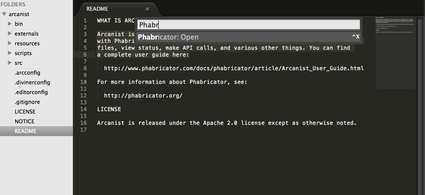
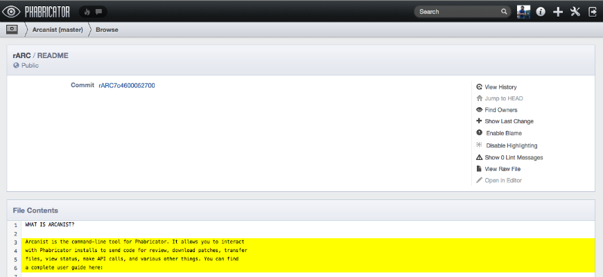

# sublime-phabricator

Open files in [Phabricator][] via [Sublime Text][]

This was built to remove the inconvenience of switching to CLI and losing the context of line numbers. It is strongly inspired by [GitHubinator][].

[Phabricator]: http://phabricator.org/
[Sublime Text]: http://sublimetext.com/
[GitHubinator]: https://github.com/ehamiter/ST2-GitHubinator





## Getting Started
### Installation
This package is available under `phabricator` inside of [Package Control][], a [Sublime Text][] plugin that allows for easy management of other plugins.

[Sublime Text]: http://www.sublimetext.com/
[Package Control]: http://wbond.net/sublime_packages/package_control

If you prefer the manual route, you can install the script via the following command in the Sublime Text terminal (``ctrl+` ``) which utilizes `git clone`.

```python
import os; path=sublime.packages_path(); (os.makedirs(path) if not os.path.exists(path) else None); window.run_command('exec', {'cmd': ['git', 'clone', 'https://github.com/twolfson/sublime-phabricator', 'phabricator'], 'working_dir': path})
```

Packages can be uninstalled via "Package Control: Remove Package" via the command pallete, `ctrl+shift+p` on Windows/Linux, `command+shift+p` on Mac.

## Documentation
_(Coming soon)_

## Contributing
In lieu of a formal styleguide, take care to maintain the existing coding style. Add unit tests for any new or changed functionality.

## License
Copyright (c) 2014 Todd Wolfson

Licensed under the MIT license.
